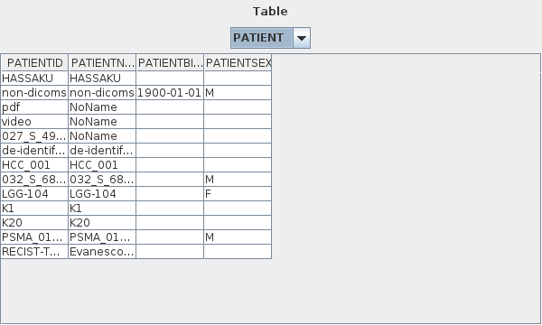

# データベース

GRAPHY は患者情報・スタディ情報・シリーズ情報・画像情報を **Apache Derby** の組み込みデータベースに管理します。
外部のデータベースサーバーは不要で、GRAPHY を起動するだけで自動的にデータベースが作成されます。

## データベースの構成

### テーブル一覧

| テーブル名 | 内容 |
|---|---|
| PATIENT | 患者情報（患者 ID、氏名、生年月日、性別） |
| STUDY | スタディ情報（スタディ日付、UID、説明、モダリティ） |
| SERIES | シリーズ情報（シリーズ番号、UID、モダリティ、画像枚数） |
| IMAGE | インスタンス情報（SOP UID、ファイルパス） |
| SERVERS | 通信先 DICOM サーバー情報（AE Title、ホスト、ポート） |
| ROI | ROI（関心領域）情報とマスクデータ |

### DICOM 階層構造

```
PATIENT（患者）
  └─ STUDY（スタディ）
       └─ SERIES（シリーズ）
            └─ IMAGE（インスタンス）
```

---

<!-- new-page -->

## データベースの場所

デフォルトの保存場所は以下のとおりです：

=== "Windows"
    ```
    C:\Users\{ユーザー名}\.graphy\db\
    ```

=== "Linux / macOS"
    ```
    ~/.graphy/db/
    ```

保存場所は[環境設定](settings.md)の `LocalDBLocation` で変更できます。

---

## Database Browser

データベースの内容を直接参照するためのデバッグツールです。

### 起動方法

メインメニュー → **ツール** → **Database Browser**

<!-- スクリーンショット: db_browser_01.png — Database Browser ダイアログ全体。テーブル選択コンボボックス、SQLクエリ入力欄、結果テーブルが見えている状態 -->


### 使い方

1. テーブルのプルダウンから参照したいテーブルを選択する（PATIENT / STUDY / SERIES / IMAGE / SERVERS / ROI）
2. SQL 文を入力して **Execute** ボタンをクリックする
3. 結果が下部のテーブルに表示される

!!! warning "直接編集について"
    Database Browser はデバッグ・確認用途のツールです。
    データを直接編集・削除した場合、GRAPHY の動作に影響が出る可能性があります。
    通常の操作はメインスクリーンから行ってください。

---

<!-- new-page -->

## DICOM サーバー情報の管理

外部の DICOM サーバー（モダリティ、PACS など）への接続情報は **SERVERS** テーブルで管理します。

### 登録方法

[メインスクリーン](main-screen.md)の **Query/Retrieve** パネルからサーバーを登録します。

<!-- スクリーンショット: db_servers_01.png — サーバー設定ダイアログ。AE Title, Host, Port の入力欄が見えている状態 -->


### 設定項目

| 項目 | 説明 |
|---|---|
| AE Title | DICOM AE タイトル（例: `GRAPHY`） |
| Host | ホスト名または IP アドレス |
| Port | DICOM ポート番号（デフォルト: 11112） |

---

## データベースのバックアップ

データベースディレクトリごとコピーすることでバックアップできます。

```bash
cp -r ~/.graphy/db/ ~/backup/graphy_db_$(date +%Y%m%d)/
```

!!! note "GRAPHY を終了した状態でバックアップしてください"
    GRAPHY 起動中にデータベースディレクトリをコピーすると、データが不完全になる場合があります。
