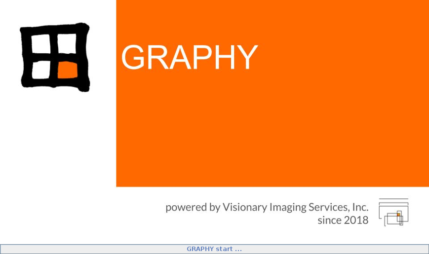
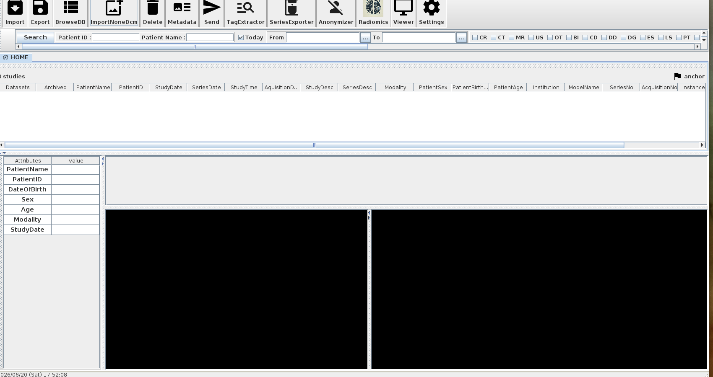

# はじめに

<!-- スクリーンショット: intro_splash_01.png — 起動時のスプラッシュスクリーン全体 -->


## GRAPHY とは

**GRAPHY** は、医療用 DICOM 画像を表示・解析するためのオープンソースのデスクトップアプリケーションです。
Java で実装されており、Windows・Linux・macOS（実験的）で動作します。

主な機能：

| 機能カテゴリ | 内容 |
|---|---|
| データベース | 組み込み Apache Derby による患者/スタディ/シリーズ管理 |
| DICOM 通信 | DIMSE (C-STORE/C-FIND/C-MOVE/C-GET) による送受信 |
| 2D ビューワ | マルチフレーム表示、WW/WL 調整、各種 ROI 計測 |
| 3D ビューワ | OpenGL 3.3 によるボリュームレンダリング・メッシュ表示 |
| MPR | Axial/Sagittal/Coronal の同時表示 |
| Slicer | 任意断面・斜め断面スライス |
| Radiomics | RadiomicsJ 連携による放射線腫瘍学的特徴量計算 |
| プラグイン | PlugIn インターフェースによる機能拡張 |

---

## 動作環境

### 推奨 OS

- **Windows 10** 以降（CD/DVD 書き込み機能を含む全機能対応）
- **Linux** — Ubuntu 22.04 LTS 以降
- **macOS** — 動作確認中（一部機能を除く）

### Java

| 項目 | 値 |
|---|---|
| バージョン | Java 11 |
| ディストリビューション | Eclipse Temurin (AdoptiumOpenJDK11) |

!!! warning "Java バージョンについて"
    Java 11 以外のバージョンでの動作は保証されません。
    [Adoptium 公式サイト](https://adoptium.net/)から Temurin 11 をインストールしてください。

### ハードウェア要件

| 項目 | 最小 | 推奨 |
|---|---|---|
| CPU | デュアルコア 1.5 GHz | クアッドコア 2.5 GHz 以上 |
| メモリ | 4 GB | 16 GB 以上 |
| GPU | OpenGL 3.3 対応 | VRAM 2 GB 以上 |
| ストレージ | 500 MB（本体） | SSD 推奨 |
| 解像度 | 1280 × 800 | 1920 × 1080 以上 |

---

<!-- new-page -->

## インストール

### Java のインストール

1. [https://adoptium.net/](https://adoptium.net/) にアクセスする
2. **Temurin 11 (LTS)** を選択してダウンロードする
3. インストーラーの指示に従いインストールする

### GRAPHY のダウンロード

1. [GitHub リリースページ](https://github.com/tatsunidas/GRAPHY/releases) から最新版をダウンロードする
2. ZIP ファイルを任意の場所に展開する

### 起動方法

=== "Windows"
    ```bat
    graphy.bat
    ```
    または `graphy.jar` をダブルクリック

=== "Linux / macOS"
    ```bash
    java -jar graphy.jar
    ```

    メモリ量を指定して起動する場合：
    ```bash
    java -Xms512m -Xmx4096m -jar graphy.jar
    ```

<!-- スクリーンショット: intro_startup_01.png — 起動直後のメインウィンドウ（初回起動でデータなしの状態） -->


!!! tip "初回起動時"
    初回起動時はデータベースが自動的に作成されます。
    デフォルトの保存場所は `$HOME/.graphy/db/` です（[環境設定](settings.md)で変更可能）。

---

## ライセンス

GRAPHY は **Mozilla Public License Version 2.0 (MPL 2.0)** のもとで公開されています。

- ライセンス全文: [LICENSE](https://github.com/tatsunidas/GRAPHY/blob/master/LICENSE)
- 連絡先: t_kobayashi@vis-ionary.com
