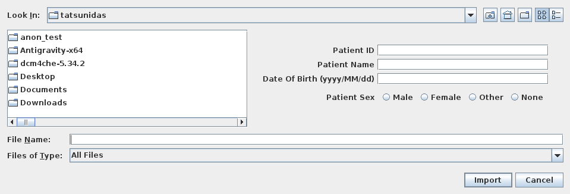
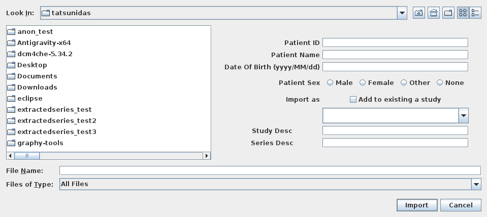
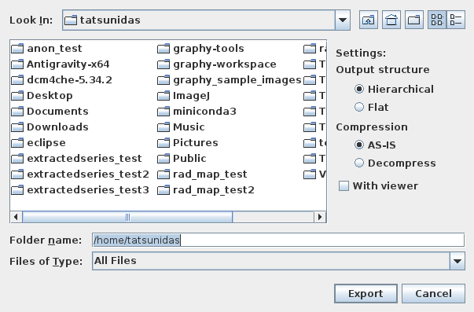
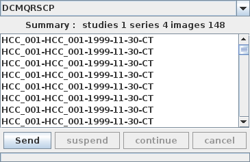
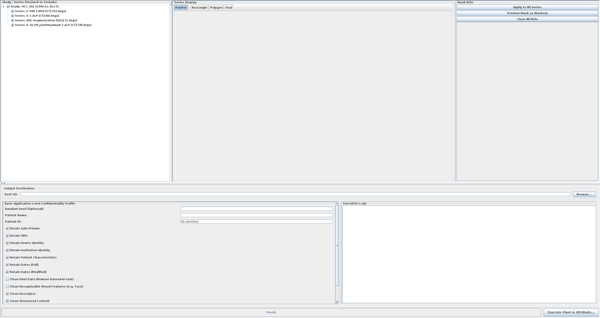
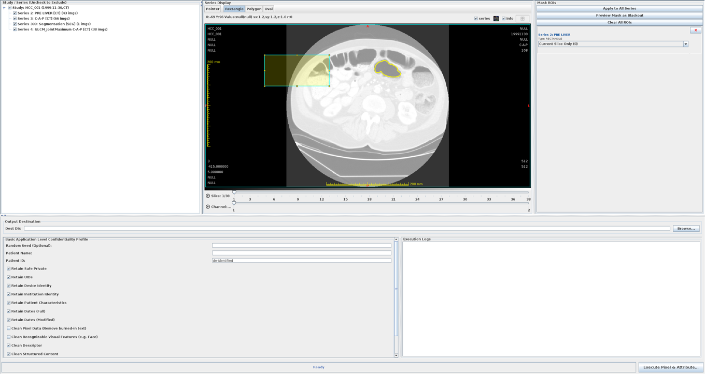

# 入出力データ

## DICOM ファイルのインポート

ローカルフォルダまたはファイルから DICOM データをデータベースに取り込みます。

### 手順

1. メインメニュー → **ファイル** → **DICOM インポート**、またはツールバーの **インポート** ボタンをクリックする

    <!-- スクリーンショット: io_import_01.png — DICOM インポートダイアログ。左にファイルチューザー、右に DicomImporterPanel（インポート設定、プレビュー情報）が表示されている状態 -->
    

2. ファイルまたはフォルダを選択する（複数選択可能）
3. 右パネルで患者情報を確認する
4. **Import** ボタンをクリックする

### 対応データ形式

| 形式 | 拡張子 | 備考 |
|---|---|---|
| DICOM | `.dcm`、拡張子なし | 標準 DICOM Part 10 |
| DICOMDIR | `DICOMDIR` | CD/DVD メディアのディレクトリファイル |

### 転送構文（Transfer Syntax）

以下の圧縮形式に対応しています：

- 非圧縮（リトルエンディアン / ビッグエンディアン）
- JPEG 圧縮（ロッシー・ロスレス）
- JPEG 2000
- RLE ランレングス圧縮

---

<!-- new-page -->

## 非 DICOM データのインポート

DICOM 以外の医療画像や動画ファイルを DICOM 形式に変換してインポートできます。

<!-- スクリーンショット: io_nondcm_01.png — 非DICOM インポートパネル。ファイル種別選択（NIfTI / 画像 / PDF / 動画）のタブが見えている状態 -->

### NIfTI (.nii / .nii.gz)

1. メインメニュー → **ファイル** → **NIfTI インポート**
2. `.nii` または `.nii.gz` ファイルを選択する
3. 変換パラメータを設定する
4. **インポート** をクリックする

### 静止画（PNG / JPEG / BMP / TIFF など）

1. メインメニュー → **ファイル** → **画像インポート**
2. 画像ファイルを選択する（複数選択でスタック化）
3. 患者情報を入力する
4. **インポート** をクリックする

### PDF

PDF ファイルをページごとに DICOM 画像（Encapsulated PDF）として取り込みます。

### 動画ファイル（MP4 / AVI など）

動画ファイルをフレームごとに DICOM マルチフレーム画像として取り込みます。

!!! note "動画インポートの制約"
    動画の各フレームが個別の DICOM インスタンスとして作成されます。
    フレーム数が多い場合は処理に時間がかかります。

---

<!-- new-page -->

## DICOM ファイルのエクスポート

データベース内の DICOM データをファイルとして書き出します。

### 手順

1. メインスクリーンのツリーテーブルで対象のスタディまたはシリーズを選択する
2. 右クリック → **エクスポート**、またはメニュー → **ファイル** → **エクスポート**

    <!-- スクリーンショット: io_export_01.png — エクスポートオプションパネル。出力先フォルダ選択、転送構文選択のオプションが表示されている状態 -->
    

3. 出力先フォルダを選択する
4. 転送構文（非圧縮 / JPEG / JPEG 2000 など）を選択する
5. **エクスポート** をクリックする

---

## DICOM ネットワーク通信（DIMSE）

GRAPHY は DICOM DIMSE プロトコルによるネットワーク通信に対応しています。

### サービス対応表

| サービス | SCU（送信側） | SCP（受信側） |
|---|---|---|
| C-STORE | ✅ データ送信 | ✅ データ受信 |
| C-FIND | ✅ 検索 | ✅（DB から応答） |
| C-MOVE | ✅ データ移動要求 | ✅ |
| C-GET | ✅ | — |

### C-STORE SCU（データ送信）

<!-- スクリーンショット: io_dimse_send_01.png — DICOM 送信ダイアログ。送信先サーバー選択、転送構文設定、進捗バーが見えている状態 -->

1. ツリーテーブルで送信したいスタディ/シリーズを選択する
2. 右クリック → **DICOM 送信**
3. 送信先サーバーを選択する
4. **送信** をクリックする

### C-STORE SCP（データ受信サーバー）

GRAPHY は起動中に SCP として動作し、他の DICOM 機器からの送信を受け付けます。

設定は[環境設定](settings.md)または Query/Retrieve パネルから行います。

### Query/Retrieve

外部 DICOM サーバーを検索してデータを取得します。詳しくは[メインスクリーン](main-screen.md#queryretrieve)を参照してください。

---

## DICOMweb ネットワーク通信（QIDO-RS / WADO-RS / STOW-RS）

GRAPHY は DIMSE に加え、HTTP/REST ベースの **DICOMweb** サービスもサポートします。
外部システムや Web ブラウザベースのビューワとの連携に適しています。

| サービス | 説明 |
|---|---|
| QIDO-RS | HTTP GET でスタディ・シリーズ・インスタンスを検索（DICOM JSON レスポンス） |
| WADO-RS | HTTP GET で DICOM ファイルを取得（multipart/related） |
| STOW-RS | HTTP POST で DICOM ファイルを GRAPHY へ保存 |

設定・使用方法の詳細は **[DICOMweb](dicomweb.md)** を参照してください。

---

<!-- new-page -->

## 匿名化

患者個人情報を除去または置換して DICOM データを匿名化します。

### 手順

1. ツリーテーブルでスタディを選択する
2. 右クリック → **匿名化**

    <!-- スクリーンショット: io_anon_01.png — 匿名化ダイアログ全体。左に対象スタディのチェックボックスツリー、右にタグ設定パネルが表示されている状態 -->
    

3. 匿名化するタグを確認・カスタマイズする
4. **実行** をクリックする

### 匿名化ルール

| 処理 | 内容 |
|---|---|
| 削除 | タグの値を空にする |
| 置換 | 任意の値に置き換える（例: 患者名を "Anonymous"） |
| UID 再生成 | SOP UID などの識別子を新規生成する |
| ピクセル匿名化 | 画像の焼き付き文字領域を塗りつぶす |

### ピクセル匿名化

スキャナが画像に直接焼き付けた患者情報（Burned-in Annotation）を矩形領域で塗りつぶします。

<!-- スクリーンショット: io_anon_pixel_01.png — ピクセル匿名化ダイアログ。画像プレビューに塗りつぶし領域（赤矩形）が表示されている状態 -->

---

## CD / DVD 書き込み（Windows のみ）

<!-- スクリーンショット: io_cdburn_01.png — CD 書き込みダイアログ。対象スタディ一覧とドライブ選択が表示されている状態 -->

1. ツリーテーブルでスタディを選択する
2. メインメニュー → **ツール** → **CD/DVD に書き込む**
3. 書き込むドライブを選択する
4. **書き込み開始** をクリックする

!!! note "Weasis との連携"
    CD/DVD には Weasis ビューワが同梱されます（Windows のみ）。
    他の PC で CD を開くと Weasis が自動起動します。

!!! warning "対応 OS"
    CD/DVD 書き込み機能は **Windows** のみ対応しています。
