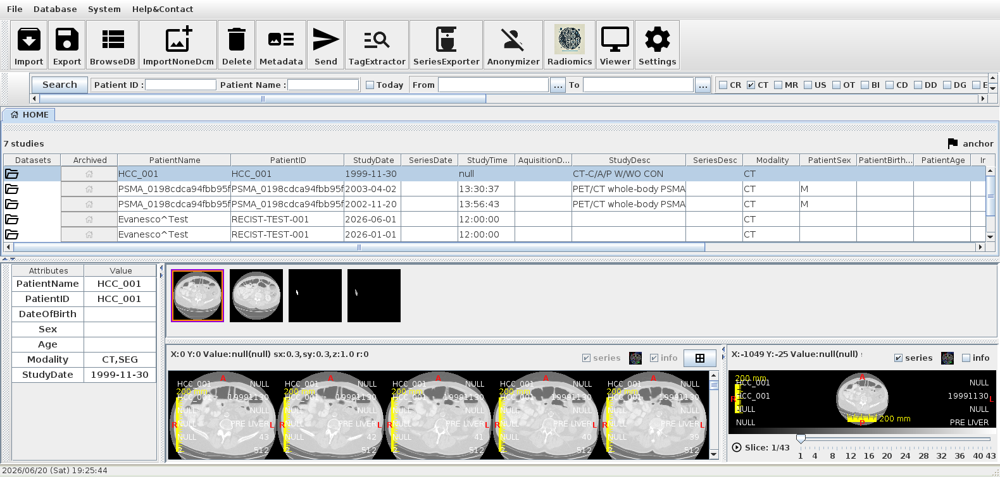
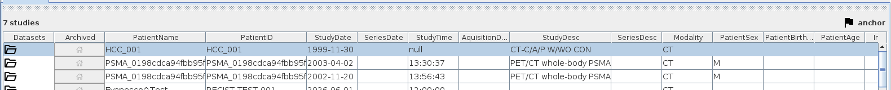
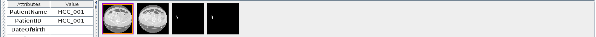

# データベースウィンドウ（MainScreen）

メインスクリーンは GRAPHY を起動したときに最初に表示される画面です。
患者・スタディ・シリーズを管理し、各ビューワを起動するためのハブになります。

<!-- スクリーンショット: main_overview_01.png — メインスクリーン全体。メニューバー、ツールバー、検索バー、DICOMツリーテーブル、BirdsEyeView（サムネイル）が見えている状態 -->


## 画面構成

| エリア | 説明 |
|---|---|
| メニューバー | ファイル・ツール・設定などの操作メニュー |
| メインツールバー | 頻繁に使う操作のショートカットボタン |
| 検索バー | 患者名・スタディ日付などによる絞り込み検索 |
| DICOM ツリーテーブル | 患者 → スタディ → シリーズの階層ツリー |
| BirdsEyeView | 選択シリーズのサムネイル一覧 |
| ステータスバー | 現在の操作状態・進捗の表示 |

---

<!-- new-page -->

## DICOM ツリーテーブル

### 階層構造

```
📁 患者（Patient）
   └─ 📂 スタディ（Study）
        ├─ 📋 シリーズ（Series）— CT AXIAL
        ├─ 📋 シリーズ（Series）— MRI T2
        └─ 📋 シリーズ（Series）— PET
```

<!-- スクリーンショット: main_treetable_01.png — DICOM ツリーテーブルの拡大。患者ノード展開済みで、スタディとシリーズが表示されている状態 -->


### 列の説明

| 列名 | 内容 |
|---|---|
| 名前 | 患者名 / スタディ説明 / シリーズ説明 |
| 日付 | スタディ日付 / シリーズ日付 |
| モダリティ | CT、MRI、PT、US など |
| 枚数 | シリーズの画像枚数 |
| UID | SOP UID / Study UID |

### 基本操作

| 操作 | 動作 |
|---|---|
| クリック | ノードを選択 |
| ダブルクリック（シリーズ） | 2D ビューワで開く |
| ▶ ボタン | ノードを展開 |
| 右クリック | コンテキストメニューを表示 |

### ドラッグ & ドロップ

ローカルフォルダをツリーテーブルにドロップすると、DICOM ファイルが自動的にインポートされます。

---

<!-- new-page -->

## 右クリックメニュー（コンテキストメニュー）

ツリーテーブルのシリーズまたはスタディを右クリックすると、以下の操作が利用できます：

<!-- スクリーンショット: main_contextmenu_01.png — ツリーテーブル上での右クリックコンテキストメニュー。主要なメニュー項目が見えている状態 -->


| メニュー項目 | 説明 |
|---|---|
| 2D ビューワで開く | 選択シリーズを 2D ビューワで表示 |
| 3D ビューワで開く | 選択シリーズを 3D ビューワで表示 |
| MPR を開く | MPR ウィンドウで表示 |
| Slicer を開く | Slicer ウィンドウで表示 |
| Radiomics | Radiomics 特徴量計算ウィンドウを開く |
| DICOM 送信 | 外部サーバーへ送信 |
| エクスポート | ファイルに書き出す |
| 匿名化 | 患者情報を匿名化する |
| DICOM タグ表示 | DICOM タグ一覧を表示 |
| 削除 | データベースから削除 |

---

## 検索・フィルタリング

### 検索バー

<!-- スクリーンショット: main_search_01.png — 検索バーの拡大。テキスト入力欄と検索条件プルダウンが表示されている状態 -->


検索バーにキーワードを入力すると、患者名・患者 ID・スタディ日付で絞り込みが行われます。

| 入力例 | 検索対象 |
|---|---|
| `Yamada` | 患者名に "Yamada" を含むレコード |
| `20240101` | スタディ日付が 2024年1月1日のレコード |
| `CT` | モダリティが CT のシリーズ |

### 詳細検索

メニュー → **検索** → **詳細検索** から、複数条件を組み合わせた検索が行えます。

<!-- スクリーンショット: main_search_advanced_01.png — 詳細検索ダイアログ。複数の条件行（項目/演算子/値）が追加されている状態 -->


---

<!-- new-page -->

## BirdsEyeView（サムネイル一覧）

画面下部のパネルに、選択中シリーズのサムネイル画像が一覧表示されます。

<!-- スクリーンショット: main_bev_01.png — BirdsEyeView パネルの全体。複数のサムネイル画像（CT スライス）が横に並んでいる状態 -->


- サムネイルをクリックすると、2D ビューワで該当スライスが表示されます
- サムネイルはスライス順に並んでいます

---

## Query/Retrieve（外部 DICOM サーバー検索）

外部の DICOM サーバー（PACS、モダリティなど）を検索してデータを取得します。

### 起動

メインツールバー → **Q/R** ボタン、またはメニュー → **ツール** → **Query/Retrieve**

<!-- スクリーンショット: main_qr_01.png — Query/Retrieve ダイアログ全体。サーバー選択プルダウン、検索条件入力欄（患者名、スタディ日付など）、検索結果ツリーテーブルが表示されている状態 -->


### 手順

1. 接続先サーバーをプルダウンから選択する
2. 検索条件（患者名・スタディ日付・モダリティなど）を入力する
3. **検索（C-FIND）** をクリックする
4. 検索結果から取得したいスタディ/シリーズを選択する
5. **取得（C-MOVE / C-GET）** をクリックする

### サーバー設定

**サーバー追加** ボタンで新しい DICOM サーバーを登録します。

| 項目 | 説明 |
|---|---|
| AE Title | 相手の DICOM AE タイトル |
| Host | ホスト名または IP アドレス |
| Port | DICOM ポート番号 |
| Our AE Title | GRAPHY 自身の AE タイトル |

---

## DICOM タグビューワ

選択した DICOM ファイルのタグ（属性）を一覧表示します。

<!-- スクリーンショット: main_tags_01.png — DICOM タグビューワダイアログ。タグ番号、VR、値の3列テーブルが表示されている状態 -->


ツリーテーブルで右クリック → **DICOM タグ表示** で起動します。
