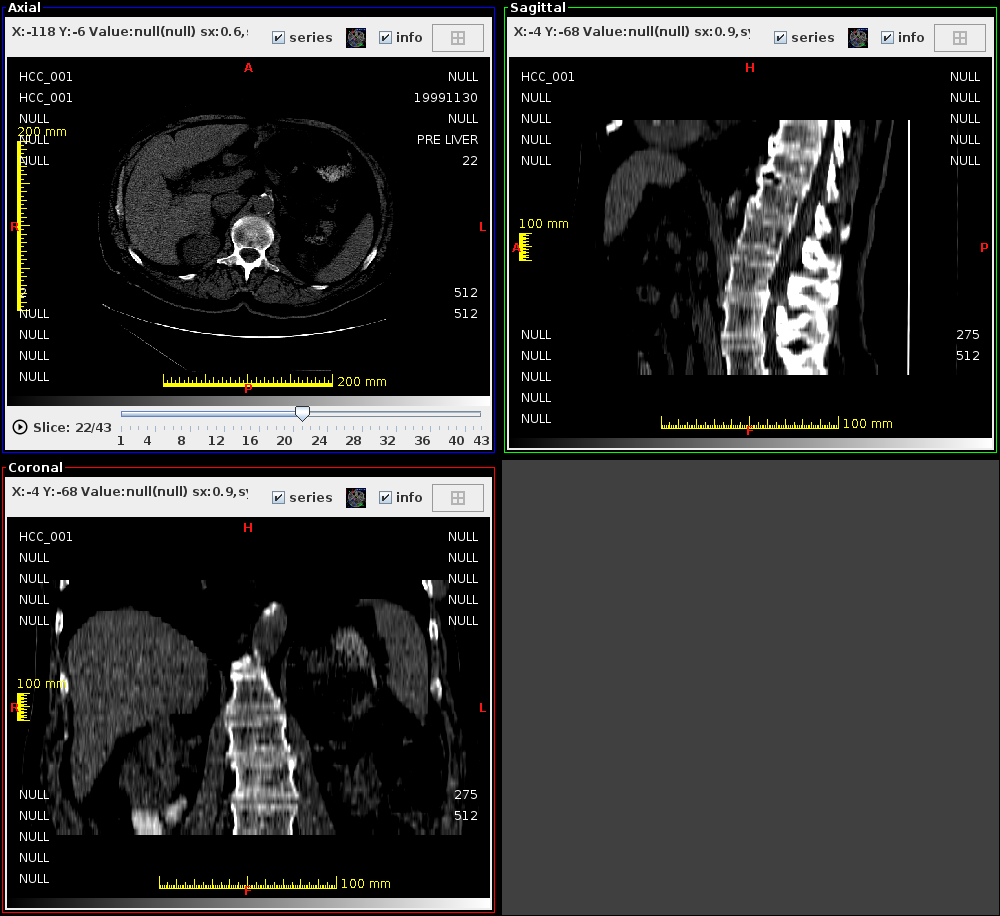
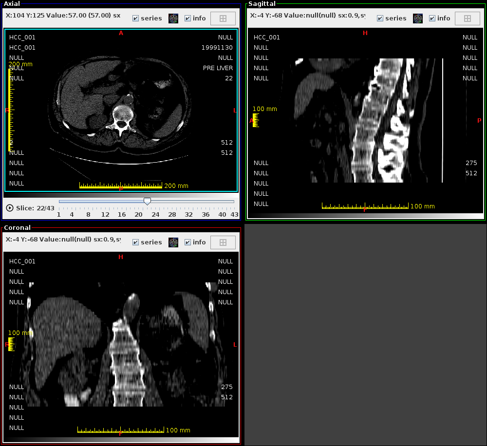

# MPR ウィンドウ

MPR（Multi-Planar Reconstruction）ウィンドウは、DICOM ボリュームを
**Axial（横断面）・Sagittal（矢状断面）・Coronal（冠状断面）** の 3 方向で同時表示します。
クロスヘアを動かすと 3 断面が連動してスクロールされます。

<!-- スクリーンショット: mpr_overview_01.png — MPRウィンドウ全体。3x1または2x2のレイアウトでAxial、Sagittal、Coronalの3断面と、中央にクロスヘアが表示されている状態 -->


!!! note "必要な画像データ"
    MPR は 3D ボリュームデータ（複数スライスの DICOM シリーズ）が必要です。
    単一スライスのシリーズでは機能しません。

## 起動方法

- メインスクリーンでシリーズを右クリック → **MPR を開く**
- 2D ビューワのメニュー → **MPR**

起動時に「Loading...」プログレスダイアログが表示され、3 断面が再構成されます。

---

## 画面構成

```
┌──────────────┬──────────────┐
│    Axial      │   Sagittal   │
│  （横断面）   │  （矢状断面）│
├──────────────┼──────────────┤
│   Coronal     │              │
│  （冠状断面） │    (空欄)    │
└──────────────┴──────────────┘
```

各断面ビューポートには以下が表示されます：

- 断面名のラベル（Axial / Sagittal / Coronal）
- クロスヘア（他断面への交点）
- スライス位置の目盛り

---

<!-- new-page -->

## クロスヘア操作

| 操作 | 動作 |
|---|---|
| いずれかの断面でクリック | クリック位置でクロスヘアを移動（3 断面が連動） |
| マウスホイール | 選択断面のスライスをスクロール |
| 右ドラッグ | WW/WL 調整 |
| 中ドラッグ / 左ドラッグ（パンモード） | 画像を平行移動 |

<!-- スクリーンショット: mpr_crosshair_01.png — MPR の3断面にクロスヘアが表示されている状態。横断面でクリックした位置が他の2断面にも反映されている -->


---

## 画像方向の自動判定

DICOM タグ (`Image Orientation (Patient)`, `Image Position (Patient)`) を読み取り、
ボリュームがどの方向向きであるかを自動判定します。

対応している元の画像断面：

| ベース断面 | 説明 |
|---|---|
| Axial（横断面） | 頭尾方向スキャン（通常の CT/MRI） |
| Sagittal（矢状断面） | 左右方向スキャン |
| Coronal（冠状断面） | 前後方向スキャン |

---

<!-- new-page -->

## WW/WL 調整

各断面ビューポートで個別に WW/WL を調整できます。

- **右ドラッグ**：水平 → WW、垂直 → WL
- 1 つの断面で調整すると、3 断面すべてに同期適用されます

---

## ガントリチルト補正

MPR ウィンドウはガントリチルトを自動補正してから再構成します。
CT のガントリチルトデータが DICOM タグに含まれている場合、自動的に適用されます。

<!-- スクリーンショット: mpr_gantry_01.png — ガントリチルト補正あり/なしの比較（2枚並べた状態または補正済みの断面のみ） -->


---

## パフォーマンスに関する注意事項

- スライス枚数が多いシリーズ（500 枚以上）では起動に時間がかかります
- 高解像度ボリューム（512 × 512 × 500 以上）ではメモリ消費が増大します
- 必要に応じて[環境設定](settings.md)でヒープメモリを増やしてください
