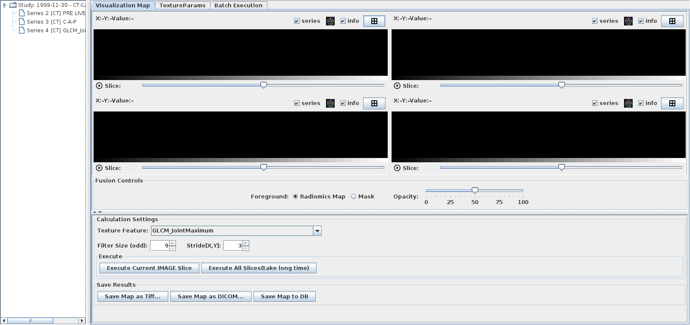
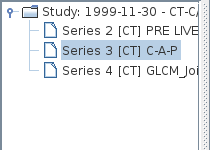
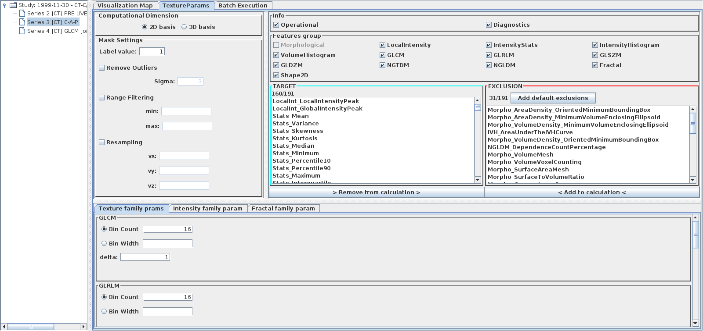
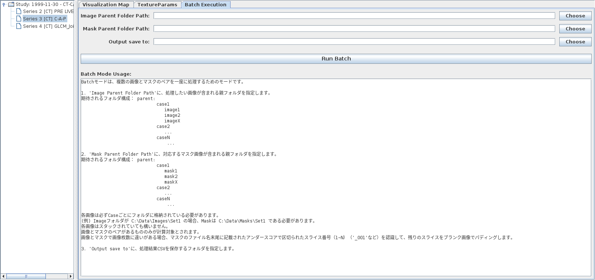

# Radiomics 特徴計算機能

GRAPHY は [RadiomicsJ](https://github.com/tatsunidas/RadiomicsJ) ライブラリと連携して、
ROI 内の **放射線腫瘍学的特徴量（Radiomics Features）** を計算します。
腫瘍の定量化・機械学習との連携に使用できます。

<!-- スクリーンショット: radiomics_overview_01.png — Radiomicsウィンドウ全体。左にシリーズツリー、右にタブパネル（Visualization Map / TextureParams / Batch Execution）が表示されている状態 -->

## 起動方法

- メインスクリーンでスタディを右クリック → **Radiomics**
- 2D ビューワの ROI 右クリックメニュー → **Radiomics**

---

## 画面構成

| パネル | 説明 |
|---|---|
| シリーズツリー（左） | 対象スタディのシリーズ一覧 |
| Visualization Map タブ | 特徴量マップの可視化 |
| TextureParams タブ | 計算パラメータの設定 |
| Batch Execution タブ | バッチ処理（複数スタディ一括計算） |

---

<!-- new-page -->

## 基本的な使い方

### 1. シリーズと ROI の選択

1. 左パネルのシリーズツリーから解析対象シリーズを選択する

    <!-- スクリーンショット: radiomics_series_01.png — Radiomicsウィンドウの左パネル。シリーズツリーが展開されており、CTシリーズが選択されている状態 -->
    

2. シリーズをダブルクリックすると 2D ビューワが起動する
3. 2D ビューワで ROI を描画する（楕円 / 多角形 / フリーハンド）

### 2. 特徴量の計算

1. **Batch Execution** タブを開く
2. **Run** ボタンをクリックする
3. 計算が完了すると特徴量テーブルが表示される

<!-- スクリーンショット: radiomics_result_01.png — Radiomics計算結果テーブル。左に特徴量名（GLCM_Energy, Entropy, など）、右に計算値が並んでいる状態 -->

---

<!-- new-page -->

## テクスチャパラメータ（TextureParams タブ）

Radiomics 特徴量の計算方法を詳細に設定します。

<!-- スクリーンショット: radiomics_params_01.png — TextureParamsタブ全体。Resampling, Binning, Feature Groups などのセクションが展開されている状態 -->

### リサンプリング設定

| パラメータ | 説明 |
|---|---|
| Resample Voxel Size (mm) | 等方ボクセルへのリサンプリングサイズ |
| Interpolation Method | 補間方式（Nearest / Bilinear / Tricubic） |

### ビニング（Binning）設定

| パラメータ | 説明 |
|---|---|
| Bin Count | ヒストグラムのビン数（例: 64） |
| Bin Width | ビン幅（固定ビン幅方式） |
| Normalization | 正規化方式（None / Z-score / Min-Max） |

### 特徴量グループ

以下の特徴量グループを個別に有効 / 無効にできます：

| グループ | 略称 | 説明 |
|---|---|---|
| First Order Statistics | FOS | ヒストグラム統計量（平均・分散・歪度など） |
| Gray Level Co-occurrence Matrix | GLCM | テクスチャ行列（エネルギー・エントロピーなど） |
| Gray Level Run Length Matrix | GLRLM | ランレングス（均質性・パターン） |
| Gray Level Size Zone Matrix | GLSZM | サイズゾーン行列 |
| Gray Level Distance Zone Matrix | GLDZM | 距離ゾーン行列 |
| Neighborhood Gray Tone Difference Matrix | NGTDM | 近傍階調差行列 |
| Fractal Features | Fractal | フラクタル次元 |
| Shape Features | Shape | 形状特徴量（体積・表面積・球形度など） |

---

<!-- new-page -->

## 可視化マップ（Visualization Map タブ）

特定の特徴量をカラーマップとして画像上に重ねて表示します。

<!-- スクリーンショット: radiomics_vis_01.png — Visualization Mapタブ。CT断面上にGLCMエントロピーがヒートマップとして重ねて表示されている状態 -->

1. **Feature** プルダウンから可視化したい特徴量を選択する
2. **Colormap** でカラーマップを選択する
3. **Apply** をクリックする

---

## バッチ処理（Batch Execution タブ）

複数のスタディ・シリーズを一括して特徴量計算します。

<!-- スクリーンショット: radiomics_batch_01.png — Batch Executionタブ。スタディリスト（チェックボックス付き）と「Run Batch」ボタン、進捗バーが表示されている状態 -->

1. 計算対象のスタディ一覧を確認する（チェックで選択 / 除外）
2. 出力 CSV ファイルの保存先を指定する
3. **Run Batch** をクリックする
4. 完了後、CSV ファイルに全スタディの特徴量が書き出される

### 出力 CSV フォーマット

| 列 | 内容 |
|---|---|
| PatientID | 患者 ID |
| StudyUID | スタディ UID |
| SeriesUID | シリーズ UID |
| ROI_Label | ROI のラベル名 |
| Feature_XXX | 各特徴量の値（列ごとに特徴量） |

---

<!-- new-page -->

## 注意事項

!!! warning "ROI が必要"
    Radiomics 計算には **ROI（関心領域）** が必要です。
    事前に 2D ビューワで ROI を描画・保存してください。

!!! note "計算時間について"
    3D Radiomics（ボクセルベース）の計算は、ボリュームサイズに応じて数分かかる場合があります。
    バッチ処理中は他の作業を続けることができます。

!!! tip "機械学習との連携"
    計算した特徴量 CSV は、Python（scikit-learn）や R などの機械学習ライブラリにそのまま入力できます。
