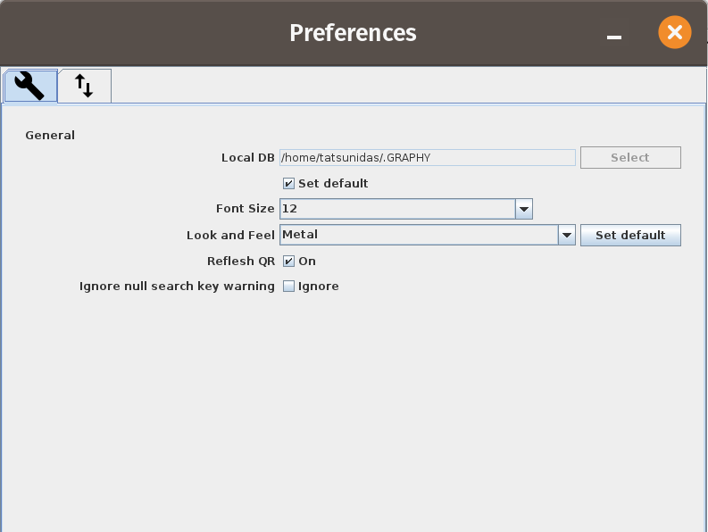

# 環境設定

GRAPHY の動作はプロパティファイル（`graphy.properties`）で管理されます。
多くの設定はアプリケーション上のダイアログから変更できます。

## 設定ファイルの場所

`graphy.properties` は、GRAPHY を起動したフォルダ直下の `conf/` サブフォルダに配置されています。

```
{GRAPHYを起動したフォルダ}/
  └── conf/
       └── graphy.properties
```

=== "Windows（例）"
    ```
    C:\Users\{ユーザー名}\GRAPHY\conf\graphy.properties
    ```

=== "Linux / macOS（例）"
    ```
    ~/GRAPHY/conf/graphy.properties
    ```

!!! tip
    設定ファイルは GRAPHY の初回起動時に自動生成されます。
    テキストエディタで直接編集することもできますが、GRAPHY を終了した状態で行ってください。

---

<!-- new-page -->

## 設定項目一覧

### 言語・地域設定

| キー | 説明 | デフォルト値 |
|---|---|---|
| `Locale` | 表示言語 (`ja` / `en` など) | `ja` |

### メモリ設定

| キー | 説明 | デフォルト値 |
|---|---|---|
| `Xms` | Java ヒープの初期サイズ（例: `512m`, `1g`） | `512m` |
| `Xmx` | Java ヒープの最大サイズ（例: `4096m`, `8g`） | `4096m` |

!!! warning "大きなボリュームを扱う場合"
    3D ビューワや MPR を使用するときは `Xmx` を **4096m 以上**（4 GB 以上）に設定することを推奨します。

### データベース設定

| キー | 説明 | デフォルト値 |
|---|---|---|
| `GraphyDBDir` | データベースディレクトリのパス | `~/.graphy/db/` |
| `UseDefaultLocalDBLocation` | デフォルト場所を使うか | `true` |
| `LocalDBLocation` | カスタムDBパス（`UseDefaultLocalDBLocation=false` の場合） | — |

### 起動設定

| キー | 説明 | デフォルト値 |
|---|---|---|
| `NO_SPLASH` | スプラッシュスクリーンを非表示にする (`true`/`false`) | `false` |
| `DICOMBackEnd` | DICOM 通信バックエンド | `DCM4CHE` |
| `DIMSE_CGET_CMOVE` | Q/R で C-GET を使うか C-MOVE を使うか | `CMOVE` |

---

<!-- new-page -->

### 画面設定

| キー | 説明 |
|---|---|
| `MainScreenX` / `MainScreenY` | メインスクリーンのウィンドウ位置 |
| `MainScreenWidth` / `MainScreenHeight` | メインスクリーンのウィンドウサイズ |
| `MainScreenDeviceID` | メインスクリーンを表示するモニターの ID |
| `Viewer2DScreenX` / `Viewer2DScreenY` | 2D ビューワのウィンドウ位置 |
| `Viewer2DScreenWidth` / `Viewer2DScreenHeight` | 2D ビューワのウィンドウサイズ |
| `Viewer2DScreenDeviceID` | 2D ビューワを表示するモニターの ID |

!!! note "マルチモニタ設定"
    上記の DeviceID を設定することで、メインスクリーンと 2D ビューワを異なるモニターに固定できます。
    設定値は自動的に保存されます。

### フォント設定

| キー | 説明 | デフォルト値 |
|---|---|---|
| `FontSize` | UI のフォントサイズ（pt） | `12` |
| `TextFont` | UI のフォント名 | `Dialog` |

### その他の表示設定

| キー | 説明 |
|---|---|
| `LookAndFeels` | UI のルック & フィール（テーマ） |
| `RefreshQRTreeTableOn` | Q/R ツリーテーブルの自動更新 |
| `IgnoreNullSearchKeyWarning` | 空キーワード検索の警告を無視する |
| `MainTreeTableKeepTopTitle` | ツリーテーブルのヘッダーを常に表示する |
| `ColumnOrder` | ツリーテーブルの列順序の保存 |

---

<!-- new-page -->

### ROI 設定

2D ビューワの ROI 描画に関する設定です。

| キー | 説明 | デフォルト値 |
|---|---|---|
| `RoiFillColor` | ROI の塗りつぶし色 | `yellow` |
| `RoiStrokeColor` | ROI の輪郭色 | `yellow` |
| `RoiStrokeWidth` | ROI の輪郭の太さ（px） | `1.0` |
| `RoiHandleColor` | ROI ハンドル（頂点）の色 | `white` |
| `RoiBrushSize` | ブラシ ROI のサイズ（px） | `10` |
| `RoiBrushType` | ブラシの形状 (`circle` / `square`) | `circle` |

色名は Java の `Color` クラスの定数名（`red`, `green`, `blue`, `yellow` など）で指定します。

---

## 設定の変更方法

### アプリケーション内での変更

<!-- スクリーンショット: settings_dialog_01.png — 環境設定ダイアログ全体。左にカテゴリリスト（言語、メモリ、DB、ROI、表示）、右に各設定項目が表示されている状態 -->


メインメニュー → **設定** → **環境設定** から設定ダイアログを開きます。

### graphy.properties の直接編集

1. GRAPHY を終了する
2. `{GRAPHYを起動したフォルダ}/conf/graphy.properties` をテキストエディタで開く
3. 設定値を変更して保存する
4. GRAPHY を再起動する

**記述例:**
```properties
Locale=ja
Xms=512m
Xmx=8192m
GraphyDBDir=/data/graphy/db
RoiFillColor=cyan
RoiStrokeWidth=2.0
FontSize=14
```

---

<!-- new-page -->

## ログ設定

GRAPHY のログは標準出力および以下のファイルに出力されます：

```
~/.graphy/logs/graphy.log
```

ログレベルは `java.util.logging` の設定で変更できます（上級者向け）。

| レベル | 説明 |
|---|---|
| `SEVERE` | エラー |
| `WARNING` | 警告 |
| `INFO` | 通常の動作情報 |
| `FINE` | デバッグ情報 |

---

## プラグイン

GRAPHY はプラグインによる機能拡張に対応しています。

### プラグインの配置

```
~/.graphy/plugins/
  └── your-plugin.jar
```

### プラグインの実装

`PlugIn` インターフェースを実装して JAR ファイルとして配置します。
詳細は [GitHub リポジトリ](https://github.com/tatsunidas/GRAPHY)の開発者向けドキュメントを参照してください。
