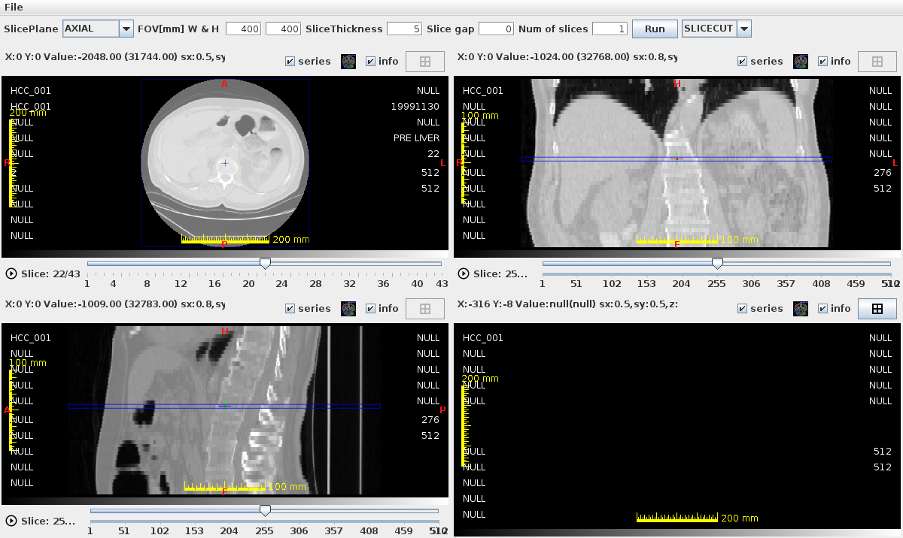
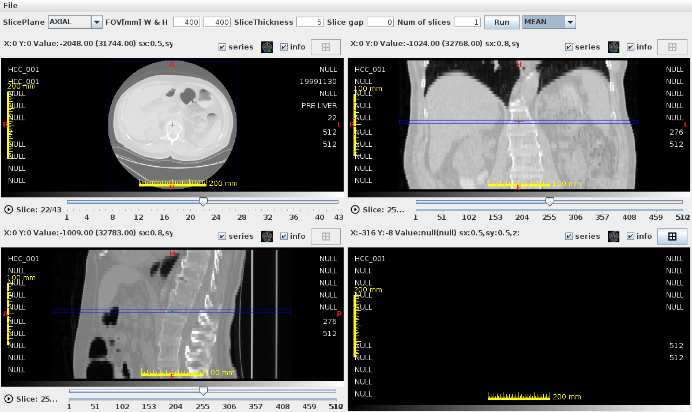

# Slicer ウィンドウ

Slicer ウィンドウは、DICOM ボリュームを **任意の断面角度** でスライスして表示します。
MPR が標準 3 断面を表示するのに対して、Slicer は斜め断面など任意の切断面を生成できます。

<!-- スクリーンショット: slicer_overview_01.png — Slicerウィンドウ全体。元のAxial断面（上段）と、生成された斜め断面（下段）が並んで表示されている状態 -->

## 起動方法

- メインスクリーンでシリーズを右クリック → **Slicer を開く**
- 2D ビューワのメニュー → **Slicer**

---

## 画面構成

Slicer ウィンドウは複数の断面ビューポートを表示します：

| パネル | 説明 |
|---|---|
| ベース断面ビュー | 元の DICOM 断面（Axial / Sagittal / Coronal） |
| リスライス断面ビュー | 任意角度でスライスし直した断面 |
| コントロールパネル | 断面角度・スラブ設定 |

---

<!-- new-page -->

## 基本操作

### 断面の操作

| 操作 | 動作 |
|---|---|
| クリック | クロスラインのアンカーを選択 |
| ドラッグ（クロスライン） | リスライス断面の位置を移動 |
| ドラッグ（回転ハンドル） | リスライス断面の角度を変更 |
| マウスホイール | スライスをスクロール |

### リスライスライン

ベース断面上に表示されるラインが、リスライスの切断面を表します。

- **ラインをドラッグ**：切断面の位置を移動
- **ラインの端をドラッグ**：切断角度を回転

<!-- スクリーンショット: slicer_reslice_01.png — Axial断面上に斜めのリスライスラインが表示されている。ラインの角度が変えられている状態 -->

---

<!-- new-page -->

## 斜め断面の生成

1. ベース断面ビューでリスライスラインの位置と角度を設定する
2. リスライス断面ビューに再構成された斜め断面が表示される

<!-- スクリーンショット: slicer_oblique_01.png — 左にAxial断面とリスライスライン、右に生成された斜め断面が表示されている状態 -->

---

## Slab 表示

複数スライスを重ねて表示する **Slab（スラブ）表示** に対応しています。

| Slab モード | 説明 |
|---|---|
| MIP (Maximum Intensity Projection) | 最大値投影 — 血管・骨の強調表示 |
| MinIP (Minimum Intensity Projection) | 最小値投影 — 気道・腸管 |
| Average | 平均値投影 |

<!-- スクリーンショット: slicer_slab_01.png — Slab設定パネル（MIP/MinIP/Averageのラジオボタン、厚みスライダー）と、MIP適用後の血管が強調された断面が表示されている状態 -->

1. コントロールパネルで **Slab モード** を選択する
2. **Slab 厚み** スライダーで重ねるスライスの枚数を設定する
3. リスライス断面ビューに MIP/MinIP/Average が適用された画像が表示される

---

<!-- new-page -->

## 参照ライン（Reference Line MPR）

Slicer ウィンドウの断面位置を MPR ウィンドウと連動させる機能です。

- MPR ウィンドウを同時に開いておくと、Slicer で選択している断面位置が MPR にも反映されます

---

## 注意事項

!!! note "メモリ消費"
    スライス枚数の多いシリーズで Slab を使用すると大量のメモリを消費します。
    必要に応じて[環境設定](settings.md)の `Xmx`（最大ヒープサイズ）を増やしてください。

!!! tip "CT 脊椎・血管検査での活用"
    脊椎の湾曲に沿ったスライスや、血管の走行に沿ったスライス（CPR: Curved Planar Reconstruction の代替）に活用できます。
