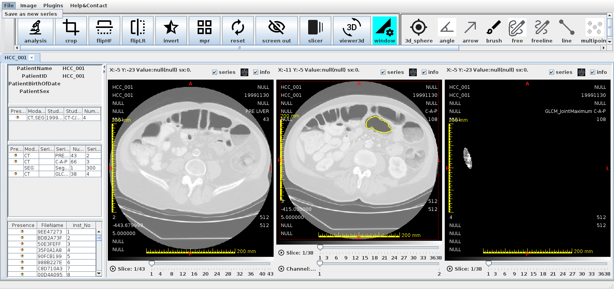
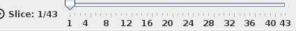
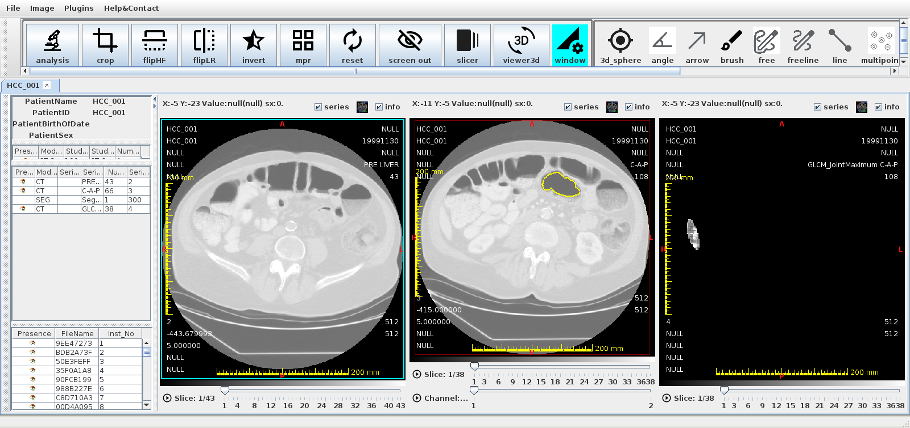
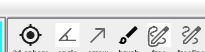
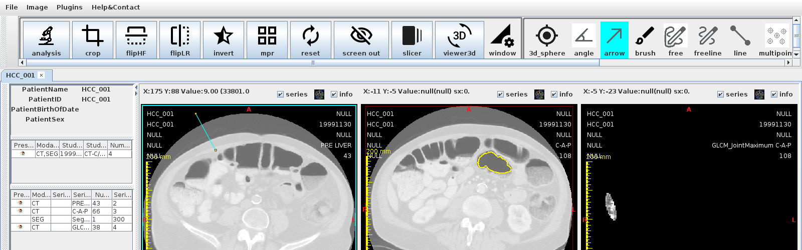
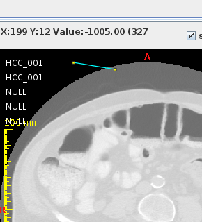

# 2D ビューワ

2D ビューワは DICOM 画像をスライスごとに表示・解析するメインのビューワです。
WW/WL 調整・ROI 計測・画像処理などの機能を備えています。

<!-- スクリーンショット: 2d_overview_01.png — 2D ビューワ全体。ツールバー、スライス画像（CTのAxial断面）、サイドパネル（シリーズリスト）、ステータスバーが見えている状態 -->

## 起動方法

- メインスクリーンのシリーズを**ダブルクリック**
- シリーズを右クリック → **2D ビューワで開く**
- シリーズをドラッグして 2D ビューワウィンドウにドロップ

---

## 画面構成

| エリア | 説明 |
|---|---|
| ツールバー | ツール選択（パン / ズーム / WW/WL / ROI など） |
| ビューポート（Stage） | 画像を表示するキャンバス領域 |
| シリーズリスト | 左サイドパネルの読み込み済みシリーズ一覧 |
| スライスリスト | 各シリーズのスライスサムネイル一覧 |
| テキストオーバーレイ | 画像上に重なる患者情報・スライス情報 |
| ステータスバー | 現在のスライス位置・ピクセル値の表示 |

---

<!-- new-page -->

## スライス操作

### スクロール

| 操作 | 動作 |
|---|---|
| マウスホイール | スライスを前後に移動 |
| <kbd>↑</kbd> / <kbd>↓</kbd> | 1 スライスずつ移動 |
| <kbd>Page Up</kbd> / <kbd>Page Down</kbd> | 10 スライスずつ移動 |
| スライダー | 任意のスライスに移動 |

### Cine（自動再生）

<!-- スクリーンショット: 2d_cine_01.png — Cine スライダーコントロールの拡大。再生ボタン、速度スライダー、コマ数表示が見えている状態 -->

ビューポート下部の Cine スライダーで自動再生（動画表示）ができます：

- **再生 / 停止** ボタン
- **速度スライダー**：再生速度を調整
- ループ再生に対応

---

<!-- new-page -->

## シリーズの並べ替え（ソート）

シリーズ内のスライスを並べる順序を切り替えます。
**インスタンス番号順**と**位置（Z軸）順**の 2 つの基準があり、それぞれ昇順・降順を選べます。

### 使い方

1. 並べ替えたい Praparat（シリーズ）を <kbd>Shift</kbd> + **左クリック**で選択する
2. メニュー → **Image** → **並べ替え** から順序を選ぶ

<!-- スクリーンショット: 2d_sort_menu_01.png — Image メニューを開き「並べ替え」サブメニューに4項目（インスタンス番号昇順/降順、位置・Z軸昇順/降順）が表示されている状態 -->

!!! warning "先にシリーズを選択してください"
    Praparat が選択されていない状態で実行すると、「先に Praparat を Shift + 左クリックで選択してください」という案内が表示されます。並べ替えは選択中のシリーズに対して行われます。

### 並べ替えの種類

| メニュー項目 | 並び順の基準 | 用途の例 |
|---|---|---|
| インスタンス番号順（昇順） | DICOM の Instance Number が小さい順 | 撮影／生成された順に並べたいとき |
| インスタンス番号順（降順） | Instance Number が大きい順 | 上記の逆順 |
| 位置 / Z軸順（昇順） | スライス断面の空間位置（IPP を断面法線へ射影した値）が小さい順 | 解剖学的な連続断面として正しく並べたいとき（既定） |
| 位置 / Z軸順（降順） | 空間位置が大きい順（頭尾方向などを反転） | スクロール方向を反転したいとき |

!!! note "既定の並び順"
    シリーズを開いた直後は **位置 / Z軸順（昇順）** で並んでいます。位置順は、各スライスの空間座標（IPP/IOP）に基づいて断面を判定するため、撮影順が空間順と一致しないデータでも解剖学的に正しい並びになります。

### 並べ替え時の挙動

- **表示中スライスは維持されます。** 並べ替えの前後で同じ画像（同一 SOP）が引き続き表示され、新しい順序での位置に移動します。
- **WW/WL（コントラスト）はスライスに追従します。** 個別に調整した値が、並べ替え後も同じ画像に対して保たれます。
- **チャンネル（C）・時相（T）の次元構成は変わりません。** 並べ替えは Z 軸（断面の並び順）だけを切り替えます。マルチチャンネル／マルチフレームのシリーズでも構造が崩れません。
- **設定はセッション内（シリーズごと）のみ有効です。** アプリケーションを再起動したり、シリーズを開き直すと既定（位置・昇順）に戻ります。
- Thick Slab（デジタルスライス厚）が有効な場合、並べ替えにより Z 方向の基準が変わるため **Original にリセット**されます。必要に応じて再設定してください。

### ROI・3D ROI との整合性

並べ替えは「**表示順（スライダーの順序）**」を変えるだけで、各スライスがもつ「**物理空間上の位置（IPP）**」は変わりません。ROI は物理空間に固定されているため、**並べ替えの前後で各スライス上の ROI の見え方は変わりません**（ROI は画像に追従します）。

- **2D ROI** … 各スライスに紐づいたまま、画像と一緒に移動します。
- **3D ROI（球 / フリーフォーム）** … 物理座標（IPP）を基準に各断面へ投影して描画されるため、Z 軸を反転しても各断面の断面像は同一です。

!!! note "逆順にすると軸が反転するように見えるが正しい"
    位置（Z軸）順を降順にすると、スクロールしたときに断面を通過する**向き（順序）が反転**します。これは表示順の反転であって、物理空間の反転ではありません。したがって 3D ROI も含め、各スライス上の表示は反転前と同一で、変わるのは「奥へ進むスクロール方向」だけです。

!!! warning "動画（MPEG）シリーズの制限"
    MPEG でエンコードされた動画シリーズは空間位置（IPP）を持たないため、**インスタンス番号順のみ**が選択可能です。位置 / Z軸順のメニュー項目は自動的に無効化されます。

---

<!-- new-page -->

## WW/WL（ウィンドウ幅 / ウィンドウレベル）

画像のコントラストを調整します。

### マウス操作

1. ツールバーで **WW/WL** ツールを選択する
2. 画像上で**右ドラッグ**する
   - 水平方向 → ウィンドウ幅（WW）を変化
   - 垂直方向 → ウィンドウレベル（WL）を変化

<!-- スクリーンショット: 2d_wwwl_01.png — WW/WL 調整中の画像。コントラストが変化しているCT画像と、右上にWW値・WL値が表示されている状態 -->

### プリセット

メニュー → **WW/WL** → **プリセット** から、臓器別の標準設定を適用できます：

| プリセット名 | WW | WL |
|---|---|---|
| 肺 (Lung) | 1500 | -600 |
| 腹部 (Abdomen) | 400 | 40 |
| 脳 (Brain) | 80 | 40 |
| 骨 (Bone) | 1500 | 300 |

### WW/WL ダイアログ

メニュー → **WW/WL** → **詳細設定** で数値を直接入力できます。

<!-- スクリーンショット: 2d_wwwl_dialog_01.png — WW/WLダイアログ。数値入力欄とヒストグラム曲線が表示されている状態 -->

---

<!-- new-page -->

## LUT（カラーマップ）

グレースケール画像に疑似カラーを適用します。

<!-- スクリーンショット: 2d_lut_01.png — LUT ピッカーダイアログ。カラーマップ一覧（Hot, Rainbow, Greenなど）のサムネイルが並んでいる状態 -->

1. ツールバーの **LUT** ボタンをクリックする
2. カラーマップ一覧からLUTを選択する
3. ビューポートに適用される

PET 画像など、特定のモダリティには推奨 LUT が自動適用されます。

---

<!-- new-page -->

## ROI（関心領域）

画像上に形状を描画して、そのエリアの統計量（平均値、標準偏差など）を計測します。

### ROI の種類

| 種類 | 説明 |
|---|---|
| 矩形 (Rectangle) | 軸平行の矩形 |
| 楕円 (Ellipse / Oval) | 楕円形 |
| 多角形 (Polygon) | 頂点を指定して描くポリゴン |
| 自由形状 (Freehand) | マウスで自由に描く閉じた形状 |
| 点 (Point) | 単一点 / マルチポイント |
| 直線 (Line) | 2 点間の距離計測 |
| 矢印 (Arrow) | アノテーション矢印 |
| テキスト (Text) | テキスト注釈 |
| 回転矩形 (Rotated Rect) | 任意角度の矩形 |
| ブラシ (Brush) | ブラシで塗り潰すマスク ROI |

### ROI の描画

1. ツールバーで目的の ROI ツールを選択する

    <!-- スクリーンショット: 2d_roi_toolbar_01.png — ツールバーのROI選択部分の拡大。各ROIアイコンが並んでいる状態 -->
    

2. 画像上でクリック（またはドラッグ）して ROI を描画する
3. 計測値がリアルタイムで表示される

<!-- スクリーンショット: 2d_roi_ellipse_01.png — CT画像上に楕円ROIが描画された状態。ROI内に平均値・標準偏差・面積が表示されている -->

### ROI 計測値

| 項目 | 単位 | 説明 |
|---|---|---|
| 平均値 (Mean) | HU / 輝度値 | ROI 内のピクセル平均 |
| 標準偏差 (Std Dev) | HU / 輝度値 | ばらつき |
| 最小値 (Min) / 最大値 (Max) | HU / 輝度値 | 最小・最大ピクセル値 |
| 面積 (Area) | mm² | キャリブレーション情報が必要 |
| 周囲長 (Perimeter) | mm | 外周の長さ |
| 長径 / 短径 | mm | 楕円・多角形など |

### ROI の保存・読み込み

ROI はデータベースに自動保存されます。
スタディを再度開くと、保存済みの ROI が復元されます。

### ROI の右クリックメニュー

<!-- スクリーンショット: 2d_roi_menu_01.png — ROI上で右クリックしたコンテキストメニュー。削除、色変更、保存、Radiomicsなどのメニュー項目が表示されている状態 -->

| メニュー | 説明 |
|---|---|
| 削除 | ROI を削除する |
| 色変更 | ROI の色を変更する |
| Radiomics | この ROI を使って Radiomics 計算を行う |
| コピー / ペースト | 別スライスに ROI をコピーする |

---

<!-- new-page -->

## セグメンテーション（マスク作成）

関心領域を**バイナリマスク**として作成・編集し、**DICOM SEG シリーズ**として保存・読み込みできます。1 つのシリーズに複数のオブジェクト（例：肝臓・腫瘍・血管）を設けられ、**各オブジェクト = 1 セグメント = 1 チャンネル**として管理されます。

<!-- スクリーンショット: 2d_seg_overview_01.png — CT画像上に複数のセグメント（肝臓=赤、腫瘍=緑など）が半透明の塗りつぶしで重畳表示されている状態 -->

!!! note "データモデル"
    マスクの実体は **`FreeFormRoi3D`（3D バイナリボリューム）**です。各オブジェクトはこの 3D マスク 1 つ＝チャンネル 1 つに対応し、空間基準（位置・向き・ボクセルサイズ）は参照シリーズからコピーされます。そのため、スライスを送っても物理空間（IPP）上の正しい断面にマスクが表示されます。1 スライスだけの領域も内部的には 3D スタックとして管理されます。

!!! warning "マスク化の対象は FreeFormRoi3D のみ"
    保存（SEG 出力）の対象は **3D マスク（FreeFormRoi3D）だけ**です。通常の 2D ROI や球 ROI（Sphere）は、そのままでは含まれません。**Roi2Mask（取込）または描画でマスク化したもの**が出力されます（後述）。

### 1. セグメントの作成と編集開始（編集セッション）

編集は「**開始 → 描画 → 終了**」のセッションで管理します。

- **開始**：**メニュー → Image → セグメンテーション → 新規セグメント**（名前を付けて空のマスクを作成）、または **ROI マネージャ**下部パネルの **[新規]** / **[編集対象に設定]**。
- 開始すると、そのマスクが**編集対象（アクティブ）**になり、以後の描画がこのマスクへ反映されます。
- **終了**：**メニュー → Image → セグメンテーション → 編集を終了**。

!!! warning "先にシリーズを選択"
    Praparat（シリーズ）が選択されていない場合は「先に Praparat を Shift + 左クリックで選択してください」と表示されます。

### 2. ツールで描画する

アクティブなセグメントがある状態で、ツールバーの ROI ツールを選ぶと、描画内容がそのマスクに焼き込まれます（**Roi2Mask**）。

| ツール | 用途 |
|---|---|
| ブラシ (Brush) | なぞって塗る／消す |
| 楕円 (Oval) / 矩形 (Rectangle) | 領域を一括追加 |
| 多角形 (Polygon) / 自由形状 (Freehand) | 輪郭を描いて領域化 |
| 直線 (Line) / フリーライン | 太さを持たせて領域化 |
| 点 (Point) | 小さな円として点を追加 |
| Wand 2D | クリック位置の連結領域を自動抽出して取り込み |
| Wand 3D | クリックから 3D 領域拡張でマスクを自動生成 |

- **追加**：通常の描画。
- **消去**：<kbd>Alt</kbd> を押しながら描画。
- スライスを送りながら各断面を塗ると、自然に 3D マスクが構築されます。

<!-- スクリーンショット: 2d_seg_paint_01.png — ブラシで腫瘍領域を塗っている最中。アクティブなマスクがマゼンタの半透明で表示されている状態 -->

!!! note "編集中の表示色"
    編集中（アクティブ）のマスクは**マゼンタ**でハイライト表示され、**編集を終了**すると本来の**セグメント色**に戻ります。

### 3. 表示の調整（ROI マネージャ）

**ROI マネージャ**下部の **セグメンテーション** パネルで、表示と管理を行います。

<!-- スクリーンショット: 2d_seg_manager_01.png — ROIマネージャ下部のセグメンテーションパネル。塗り/輪郭トグル、不透明度スライダー、新規/編集対象に設定/色/表示ボタンが並んでいる状態 -->

| コントロール | 説明 |
|---|---|
| 塗りつぶし | 塗り（半透明）/ 輪郭線のみ を切り替え（全体設定） |
| 不透明度 | 塗りの濃さを調整（全体設定） |
| 新規 | 空のセグメントを作成 |
| 編集対象に設定 | リストで選択中のセグメントを描画対象（アクティブ）にする |
| 色 | セグメントの表示色を変更 |
| 表示 | セグメントの表示 / 非表示 |

!!! tip "名前・複製・削除"
    名前の変更は情報パネルの **Name** ＋ **Save/Update Info**、複製は **Duplicate**、削除は **Delete**（いずれも既存の ROI マネージャ機能）をそのまま利用できます。

### 4. ROI ⇄ マスク 変換

- **Roi2Mask（取り込み）**：既存の **2D ROI／3D ROI（球など）** を選択し、**メニュー → Image → セグメンテーション → 選択ROIをマスクへ取込** で、アクティブなマスクへ合成します（元の ROI は残ります＝非破壊）。
- **Mask2Roi（読み戻し）**：保存済みまたは外部の **DICOM SEG を読み込み**（下記）で、編集可能な 3D マスクとして復元します。

### 5. DICOM SEG として保存／読み込み

**保存**：**メニュー → Image → セグメンテーション → DICOM SEGとして保存**。

- 全セグメントを **1 つのマルチセグメント DICOM SEG（SegmentationType=BINARY, 1bit/pixel）** として書き出し、DB に新シリーズとして登録します。
- 保存後、**HOME ツリーを更新**し、**2D ビューアにそのマスクシリーズを読み込んで表示**します。**編集を終了していなくても保存できます**。

<!-- スクリーンショット: 2d_seg_save_01.png — 保存後、HOMEツリーに新しいSEGシリーズが現れ、2Dビューアに43スライス×4チャンネルで表示されている状態 -->

**読み込み**：**メニュー → Image → セグメンテーション → DICOM SEGを読み込み...**。

- BINARY 形式の DICOM SEG を選択中のシリーズに**編集可能なマスクとして**取り込みます（名前・色・物理位置を復元）。

!!! note "往復編集"
    「DICOM SEG を読み込み（Mask2Roi）→ 編集 → DICOM SEGとして保存」で、保存済みマスクの再編集ができます。

### 6. メニューの有効／無効（フェイルセーフ）

セグメンテーション・サブメニューは、選択シリーズの状態に応じて自動的に有効／無効が切り替わります。

| 項目 | 有効になる条件 |
|---|---|
| 新規セグメント | シリーズ選択中・**非編集中** |
| DICOM SEGを読み込み | シリーズ選択中・**非編集中** |
| 選択ROIをマスクへ取込 (Roi2Mask) | **編集中のみ**（アクティブなマスクが必要） |
| DICOM SEGとして保存 | シリーズ選択中・**セグメントが存在**（編集中でも可） |
| 編集を終了 | **編集中のみ** |

---

<!-- new-page -->

### 仕様（DICOM SEG 入出力）

#### 保存（出力）の仕様

- **SOP クラス**：Segmentation Storage（`1.2.840.10008.5.1.4.1.1.66.4`）、Modality `SEG`、`SegmentationType=BINARY`、`BitsAllocated/Stored=1`。
- **参照シリーズの格子へアンカー**：行/列・向き(IOP)・ボクセルサイズ・各スライスの位置(IPP)は、**マスクを作成した参照シリーズから取得**します。各セグメントを参照シリーズの**全スライスにわたって**書き出すため、出力は**「参照スライス数 × チャンネル数」の規則格子**になります（例：43 スライスの CT 上の 4 チャンネル → ロード時は **43 スライス × 4 チャンネル**で表示）。
- **メタデータ**：患者・スタディ情報と FrameOfReferenceUID をコピー、**SOP/Series UID は新規採番**。各セグメントの **番号（1..N で一意化）・ラベル（名前）・推奨表示色（CIELab）** を保持。参照シリーズ連携（ReferencedSeriesSequence）も付与。
- **空チャンネルの除外**：参照格子上で中身が空になるセグメントは**出力に含めません**。

!!! note "フレーム数とスライス数は別物"
    DICOM SEG は **「セグメント × スライス」ごとに 1 フレーム**を持つため、**`NumberOfFrames` =（スライス数 × チャンネル数）**になります（例：43×4=172）。一方、ビューアでの**表示スライス数は 43**（チャンネルは別軸）です。「フレーム総数」と「表示スライス数」は別の値です。

#### 読み込み（取り込み）の仕様

- 対応形式は **BINARY セグメンテーション（1bit/pixel）** です（FRACTIONAL は未対応）。
- **スライスの対応付けは IPP（物理位置）ベース**です。各フレームの `ImagePositionPatient` をスライス法線へ投影し、最寄りの参照スライスへ割り当てます。そのため**スライス厚・ギャップ・FOV の差は最寄りスライスへ丸めて吸収**されます（InstanceNumber やフレーム順には依存しません）。

!!! warning "別部位・別スタディの SEG を取り込もうとした場合（安全策）"
    取り込み先シリーズと **FrameOfReferenceUID が異なる**場合（例：腹部 CT に胸部の SEG）、**確認ダイアログ**で警告します。さらに、**取り込み先シリーズと物理的に重ならないセグメントは自動的にスキップ**し、件数を通知します（全て重ならない場合は「取り込みませんでした」と表示）。これにより、誤った部位のマスクが混入したり、空チャンネルとして保存されたりすることを防ぎます。

---

<!-- new-page -->

## 画像処理

ツールバーまたはメニューから画像処理フィルタを適用できます。

| 処理 | 説明 |
|---|---|
| 平滑化 (Smooth) | ガウシアンブラーでノイズ低減 |
| シャープニング (Sharpen) | エッジを強調する |
| コントラスト強調 | ヒストグラム均一化 |
| マスキング (Masking) | ROI 外または内をマスクする |

!!! note "非破壊処理"
    画像処理はビューア上での表示に適用されます。元の DICOM データは変更されません。

---

## テキストオーバーレイ

画像の四隅に患者情報・スキャン情報が自動表示されます。

<!-- スクリーンショット: 2d_overlay_01.png — CT画像の四隅にオーバーレイ情報（患者名、スタディ日付、スライス位置、WW/WL値など）が表示されている状態 -->

| 位置 | 表示内容の例 |
|---|---|
| 左上 | 患者名、患者 ID、生年月日 |
| 右上 | スタディ日付、モダリティ、スキャン条件 |
| 左下 | スライス位置（mm）、スライス厚 |
| 右下 | WW / WL、ズーム倍率、スライス番号 |

表示 / 非表示はメニュー → **表示** → **オーバーレイ** で切り替えられます。

---

## マルチモニタ対応

2D ビューワは独立したウィンドウとして動作するため、メインスクリーンとは別のモニターに配置できます。
ウィンドウの位置は次回起動時に復元されます。

## 画像の向き表示（ローカライザー）

シリーズが複数断面で構成されている場合、選択中スライスの断面位置を他の断面に「スカウトライン」として表示します。

<!-- スクリーンショット: 2d_localizer_01.png — 2段表示（AxialとSagittal）でAxialスライスの位置がSagittal画面にラインで示されている状態 -->

