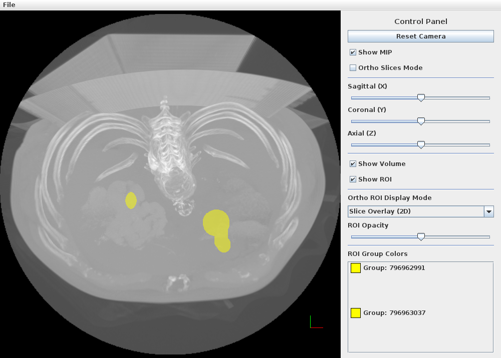
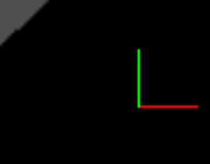

# 3D ビューワ

3D ビューワは DICOM 画像スタックから 3D ボリュームを再構成し、
OpenGL 3.3 を使ったリアルタイムレンダリングで表示します。
メッシュ（サーフェスモデル）の表示・編集にも対応しています。

<!-- スクリーンショット: 3d_overview_01.png — 3Dビューワ全体。中央にOpenGLキャンバス（脳のサーフェスメッシュ）、右側にメッシュリストパネル、上部にメニューバーとスライダーが表示されている状態 -->

!!! warning "GPU 要件"
    3D ビューワには **OpenGL 3.3 Core Profile** 対応の GPU が必要です。
    仮想マシンや古い GPU では起動しない場合があります。

## 起動方法

- メインスクリーンでシリーズを右クリック → **3D ビューワで開く**
- 2D ビューワのメニュー → **3D ビューワ**

---

## 画面構成

| エリア | 説明 |
|---|---|
| OpenGL キャンバス | 3D 画像を表示するメインビューポート |
| メッシュリストパネル | 読み込まれたメッシュの一覧（右側） |
| コントロールパネル | スライダー・チェックボックス（右側） |
| メニューバー | ファイル・表示・編集 |

---

<!-- new-page -->

## カメラ操作

| 操作 | 動作 |
|---|---|
| 左ドラッグ | 回転（オービット） |
| 右ドラッグ | 平行移動（パン） |
| マウスホイール | ズームイン / ズームアウト |
| 中クリックドラッグ | 平行移動 |
| <kbd>R</kbd> | 視点をリセット |

---

## ボリューム表示

### ボリュームレンダリング

DICOM スタックをそのままボリュームとして表示します。
CT 値（HU）に基づいて透明度・色が自動設定されます。

<!-- スクリーンショット: 3d_volume_01.png — ボリュームレンダリング表示中の3Dビューワ。腹部CTが立体的に表示されている状態 -->

### 不透明度・輝度の調整

右パネルの **Opacity** スライダーと **Brightness** スライダーで調整します。

---

<!-- new-page -->

## 3D 裁断（クリッピング）

3D バウンディングボックスで表示範囲を直方体に切り出し、
ボックス内部のみをレンダリングする機能です。
**ボリュームレンダリング (VR) / MIP / Ortho Slices / Cinematic Rendering の
すべての表示モードで利用できます。**

<!-- スクリーンショット: 3d_clip_01.png — 3D裁断が有効で、半透明の境界面と白い辺で囲まれたバウンディングボックスが表示され、ボックス内部だけがレンダリングされている状態 -->

### 使い方

1. 右パネルの **3D Clipping** にある **Edit Clip Box** チェックボックスを ON にする
2. キャンバス上にバウンディングボックスが表示される
    （境界面は半透明、辺は白で描画されます）
3. ボックスをマウスで操作して、表示したい領域を指定する
4. ボックスを狭めると、その内部だけがレンダリングされる
    （最大まで広げると全体表示と同じになります）

### マウス操作

| 操作 | 動作 |
|---|---|
| 面をドラッグ | その面を動かして裁断領域をリサイズする |
| <kbd>Shift</kbd> + ドラッグ | ボックス全体を平行移動する |
| ボックスの外をドラッグ | 通常どおりカメラを回転する |

操作中の面は強調表示（ハイライト）されます。

!!! note "裁断はチェックを外しても維持されます"
    **Edit Clip Box** チェックボックスは、バウンディングボックスの
    *表示と編集の切り替え* のみを行います。
    一度設定した裁断領域は、チェックを外しても、
    また別の表示モードに切り替えても **そのまま適用され続けます**。

    裁断を解除して全体表示に戻すには、**Reset Clip Box** ボタンを
    クリックして領域を立方体全体に戻してください。

| ボタン / チェックボックス | 動作 |
|---|---|
| Edit Clip Box | バウンディングボックスの表示・編集の ON / OFF |
| Reset Clip Box | 裁断領域を立方体全体（裁断なし）に戻す |

---

<!-- new-page -->

## メッシュ（サーフェスモデル）

### マーチングキューブ（Marching Cubes）

DICOM ボリュームから等値面（Isosurface）を自動生成します。

1. メニュー → **Mesh** → **Generate from Volume**
2. **Threshold（閾値）** を入力する（CT の場合: 骨 = 300 HU 程度）
3. **Generate** をクリックする

    <!-- スクリーンショット: 3d_marching_01.png — マーチングキューブ生成ダイアログ。閾値入力欄と「Generate」ボタンが見えている状態 -->
    

4. 生成されたメッシュが右パネルのリストに追加される

<!-- スクリーンショット: 3d_mesh_01.png — 骨格メッシュ（白色）が3D表示されている状態。右側のメッシュリストにアイテムが追加されている -->

### 外部メッシュファイルの読み込み

メニュー → **File** → **Load Mesh** から STL / OBJ 形式のメッシュファイルを読み込めます。

### メッシュのエクスポート

メニュー → **File** → **Export Mesh** から STL / OBJ 形式でエクスポートします。

---

<!-- new-page -->

## ROI 3D

3D 空間上に ROI（関心領域）を配置します。

### 球形 ROI (Sphere ROI)

1. ツールバーの **Sphere ROI** ツールを選択する
2. キャンバス上でクリックして中心位置を指定する
3. ドラッグして半径を設定する

<!-- スクリーンショット: 3d_roi_sphere_01.png — 3D表示上に半透明の球形ROIが配置されている状態 -->

### 自由形状 ROI (FreeForm ROI 3D)

ポリゴンを使って 3D 空間上で任意形状の ROI を定義します。

---

## ガントリチルト補正

CT スキャン時のガントリ（テーブル）チルトによる画像の傾きを補正します。

<!-- スクリーンショット: 3d_gantry_01.png — ガントリチルト補正ダイアログ。チルト角度入力欄と補正前後のプレビューが表示されている状態 -->

メニュー → **Tools** → **Gantry Tilt Correction** から起動します。

---

## 座標軸ギズモ

画面の隅に X / Y / Z 軸の方向を示すギズモが表示されます。

<!-- スクリーンショット: 3d_gizmo_01.png — 3Dビューワの右下隅にある座標軸ギズモの拡大。X(赤)、Y(緑)、Z(青)の軸が表示されている状態 -->

| 色 | 軸 |
|---|---|
| 赤 | X 軸（左右） |
| 緑 | Y 軸（前後） |
| 青 | Z 軸（上下） |
